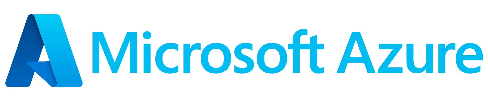

   

## Guia-Cloud > Microsoft 
> Objetivo deste guia é consolidar tudo relacionado a conhecimento no mundo de Microsoft Cloud, e ser um guia de referência para profissionais que já estão atuando na área como tambem para novos profissionais! 

## ⚠️ Aviso importante

>Conteúdo em Construção!  Se você tem algum conteúdo que possa agregar, compartilhe conosco!

## ⌛ STATUS Serviços Azure Cloud - [Link Status Serviços Microsoft](https://azure.status.microsoft/)

## 📙 MELHORES PRÁTICAS
   #### - CAF (Cloud Adoption Framework) - [Link Documentação Microsoft](https://learn.microsoft.com/pt-br/azure/cloud-adoption-framework/)
   #### - Convenção de nomenclatura - [Link Definição de nomenclatura Azure Services](https://learn.microsoft.com/pt-br/azure/cloud-adoption-framework/ready/azure-best-practices/resource-naming)
   #### - Exemplos de Abreviação de Recursos Azure (Nomenclatura) - [Link Recomendação Abreviaturas Azure Services](https://learn.microsoft.com/pt-br/azure/cloud-adoption-framework/ready/azure-best-practices/resource-abbreviations)
   
## 📗 CALCULADORA de Preços Azure Cloud
   - [Link Calculadora Microsoft](https://azure.microsoft.com/pt-br/pricing/calculator/)

## 📘 Treinamentos Oficiais
   - [Link Microsoft Learn](https://learn.microsoft.com/pt-br/training/azure/)

## 📒 Treinamentos Free

## 🍺 CONTEÚDOS COMPLEMENTARES
   ### MVPs Azure
   >Os MVPs (Most Valuable Professiona (Profissionais Mais Valiosos)) da Microsoft são especialistas em tecnologia que adoram compartilhar conhecimento com a comunidade. 
   - [Link Portal MVP Microsoft](https://mvp.microsoft.com/pt-br/MvpSearch?ex=Microsoft+Azure&sc=e)
   - [Link Portal MVP Microsoft - Brasil](https://mvp.microsoft.com/pt-br/MvpSearch?ex=Microsoft+Azure&lo=Brazil&sc=e)

   ### Cloud FinOps
   - Otimizar os custos com o Azure - [Link Portal Microsoft - Otimização de Custos](https://azure.microsoft.com/pt-pt/solutions/cost-optimization/#tools)
  
   ### Eportar Recursos Azure para Terraform **aztfexport**
   - [Link para repositório Oficial do Projeto](https://github.com/Azure/aztfexport)
 
   ### DevOps
   - STATUS Serviços Azure DevOps - [Link Status Serviços Microsoft](https://status.dev.azure.com/)

   ### Azure Speed
   >Azure Speed é uma ferramenta *não oficial* para teste de velocidade que mede a latência de sua rede, download e velocidade de upload em vários locais globais.
   - [Link Portal AzureSpeed] (https://www.azurespeed.com/)

## 📂 SITES / BLOGS RELACIONAODS

## 📂 CANAIS NO YOUTUBE COM CONTEÚDO CLOUD

## 📁 LIVROS
